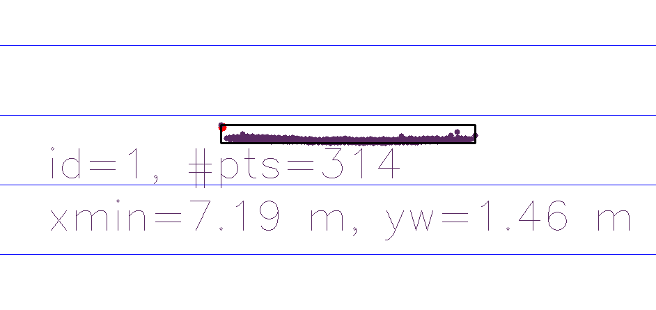
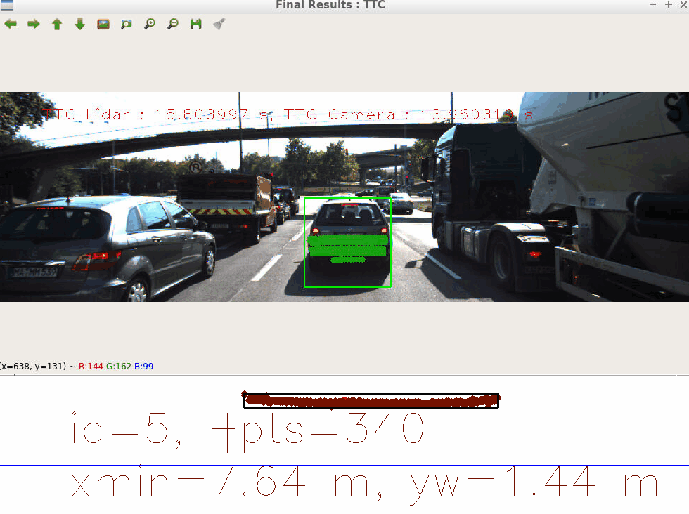

# Track an Object in 3D Space

### FP.1 Match 3D Objects:    

Implement the method ```matchBoundingBoxes()```, which takes as input both the previous and the current data frames and provides as output the ids of the matched regions of interest (i.e. the boxID property). Matches must be the ones with the highest number of keypoint correspondences.

---
**Steps:**
1. Create a map name ```bbMatchCounter``` of ID's of bounding boxes in previous freame and this frame along with its number of occurences.
2. Loop through all the matched descriptors and check wthether the matching points are within the current box. If it is, the corresponding box ID in the previous frame, which includes the matched point as well as box ID of current frame is added in the map and the number of occurences are incremented.
3. Filter out bounding box matches on both frames based of the number of occurences as computed in Step - 2 
4. Best bounding box matches are returned to the main function.
---

```matchBoundingBoxes():```  
_Step - 1:_

```C++
std::map <std::pair<int,int>, int> bbMatchCounter; // [(bbInPrevID, bbInCurreID), numOfOccurences]
```
_Step - 2:_
```C++       
for (auto& match : matches) // loop through all the matched descriptors
{
  // cv::KeyPoint prevPoint = prevFrame.keypoints[match.queryIdx];
  cv::Point prevPoint = prevFrame.keypoints.at(match.queryIdx).pt;
  // cv::KeyPoint currPoint = currFrame.keypoints[match.trainIdx];
  cv::Point currPoint = currFrame.keypoints.at(match.trainIdx).pt;

  for(auto& bboxInPrev : prevFrame.boundingBoxes)
  {
    // if (!bboxInPrev.roi.contains(prevPoint.pt))
    if (!bboxInPrev.roi.contains(prevPoint))
    {
      continue;
    }

    for (auto& bboxInCurr : currFrame.boundingBoxes)
    {
      // if(!bboxInCurr.roi.contains(currPoint.pt))
      if(!bboxInCurr.roi.contains(currPoint))
      {
        continue;
      }

      bbMatchCounter[std::make_pair(bboxInPrev.boxID, bboxInCurr.boxID)]++;
    }
}

```
_Step - 3 and Step - 4:_       
```C++               
std::vector<std::tuple<int, int, int>> bboxMatches;

// lambda expresseion to add prevBoxID, currBoxID, numOfOccurences into bboxMatches vector of tuples
std::for_each(bbMatchCounter.begin(), bbMatchCounter.end(), [&bboxMatches](std::pair<std::pair<int,int>, int> pair)
{
    bboxMatches.emplace_back(pair.first.first, pair.first.second, pair.second);
});

// lambda expression to sort the vector of tuples in descending order of numOfOccurences
std::sort(bboxMatches.begin(), bboxMatches.end(), [](const std::tuple<int, int, int>&a, const std::tuple<int,int,int>&b )
{
    return (std::get<2>(a) > std::get<2>(b));
});

std::set<int> matchedPrevBoxes; // to avoid already matched previous bounding boxes

bbBestMatches.clear();
for (auto& t : bboxMatches)
{
    if (matchedPrevBoxes.count(std::get<0>(t))) // If already matched bbox exist, then continue(to avoid repetation)
    {
        continue;
    }

    matchedPrevBoxes.insert(std::get<0>(t));
    bbBestMatches.insert(std::make_pair(std::get<0>(t), std::get<1>(t)));
    // std::cout << "Matching Bounding Boxes Complete"  << std::endl;
```
---
### FP.2 Compute Lidar-based TTC:

Compute the time-to-collision in second for all matched 3D objects using only Lidar measurements from the matched bounding boxes between current and previous frame.

---
**Steps:**
1. The raw LiDAR data is filtered to remove any outliers.
2. The minimum values in X-direction (driving direction) are set to some large value and then the filtered LiDAR cloud in both current and previous frames are ranged appropiately.
3. Filtering is performed by first converting the LiDAR data to a ```pcl::PointXYZ``` format and then performing an Euclidean Clustering. 
4. Finally the computed LiDAR TTC is retured to the main function.
---

```C++
void computeTTCLidar(std::vector<LidarPoint> &lidarPointsPrev,
                     std::vector<LidarPoint> &lidarPointsCurr, double frameRate, double &TTC)
{
  double dT = 1 / frameRate;
  double minPrevX = 1e9;
  double minCurrX = 1e9;

  pcl::PointCloud<pcl::PointXYZ>::Ptr prevLidarCloud = removeLidarOutliers(lidarPointsPrev);
  pcl::PointCloud<pcl::PointXYZ>::Ptr currLidarCloud = removeLidarOutliers(lidarPointsCurr);

  for (const auto& pt : prevLidarCloud->points)
  {
      minPrevX = minPrevX > pt.x ? pt.x : minPrevX;
  }

  for (const auto& pt : currLidarCloud->points)
  {
      minCurrX = minCurrX > pt.x ? pt.x : minCurrX;
  }

  TTC = (minCurrX * dT) / (minPrevX - minCurrX);
}
```
```C++
// performing eucledian clustering to remove outliers in LiDAR data
pcl::PointCloud<pcl::PointXYZ>::Ptr removeLidarOutliers (std::vector<LidarPoint>& lidarPoints)
{
  pcl::PointCloud<pcl::PointXYZ>::Ptr cloud (new pcl::PointCloud<pcl::PointXYZ>);
  pcl::PointCloud<pcl::PointXYZ>::Ptr result(new pcl::PointCloud<pcl::PointXYZ>);
  
  for (const auto&pt : lidarPoints)
  {
      cloud->push_back(pcl::PointXYZ((float)pt.x, (float)pt.y, 0.0f));
  }

  pcl::search::KdTree<pcl::PointXYZ>::Ptr tree (new pcl::search::KdTree<pcl::PointXYZ>);
  tree->setInputCloud(cloud);

  std::vector<pcl::PointIndices> clusterIndices;
  pcl::EuclideanClusterExtraction<pcl::PointXYZ> ec;
  ec.setClusterTolerance (0.05); 
  ec.setMinClusterSize (3); // 3
  // ec.setMaxClusterSize (15);
  ec.setSearchMethod (tree);
  ec.setInputCloud (cloud);
  ec.extract (clusterIndices);

  if (clusterIndices.empty())
  {
      return result;
  }

  for (auto& getIndices : clusterIndices)
  {
      for (int i : getIndices.indices)
      {
          result->points.push_back(cloud->points.at(i));
      }
  }

  return result;
}
```
The following figure shows the outlier removed:

<figure>
    
</figure>

---

### FP.3 Associate Keypoint Correspondences with Bounding Boxes:

---
Prepare the TTC computation based on camera measurements by associating keypoint correspondences to the bounding boxes which enclose them. All matches which satisfy this condition must be added to a vector in the respective bounding box.

---
**Steps:**
1. Calculate the mean point match distance.
2. Loop through all the keypoint matches and calculate the mean distance of those keypoints between the previous and the current frames.
3. Filter out the keypoints based to the computed mean distance from Step - 2
---

_Step - 1 and Step - 2:_

```C++
// associate a given bounding box with the keypoints it contains
void clusterKptMatchesWithROI(BoundingBox &boundingBox, std::vector<cv::KeyPoint> &kptsPrev, std::vector<cv::KeyPoint> &kptsCurr, std::vector<cv::DMatch> &kptMatches)
{
    // calculate mean point match distance
    double meanDistance = 0.0;
    double size = 0.0;

    for (auto it1 = kptMatches.begin(); it1 != kptMatches.end();  ++it1)
    {
        cv::KeyPoint currPoint = kptsCurr[it1->trainIdx];
        cv::KeyPoint prevPoint = kptsPrev[it1->queryIdx];

        if (boundingBox.roi.contains(currPoint.pt))
        {
            meanDistance += cv::norm(currPoint.pt - prevPoint.pt);
            size += 1;
        }
    }
    meanDistance = meanDistance / size;
    cout << " meanDistance: " << meanDistance << std::endl;
  
```
_Step - 3:_

```C++
   // filter out points based on the mean distance
    for (auto it2 = kptMatches.begin(); it2 != kptMatches.end(); ++it2)
    {
        cv::KeyPoint currPoint = kptsCurr[it2->trainIdx];
        cv::KeyPoint prevPoint = kptsPrev[it2->queryIdx];

        if (boundingBox.roi.contains(currPoint.pt))
        {
            double currDistance = cv::norm(currPoint.pt - prevPoint.pt);
            double scaledMeanDistance = meanDistance * 1.3;
            // cout << " currDistance: " << currDistance << std::endl;
            // cout << " scaledMeanDistance: " << scaledMeanDistance << std::endl;

            if (currDistance < scaledMeanDistance)
            {
                boundingBox.keypoints.push_back(currPoint);
                boundingBox.kptMatches.push_back(*it2);
                // cout << " BBox kptsMatches.size(): " << boundingBox.kptMatches.size() << std::endl;
            }
        }
    }
}
```
---
### FP.4 Compute Camera-based TTC:
Compute the time-to-collision in second for all matched 3D objects using only keypoint correspondences from the matched bounding boxes between current and previous frame.

---

**Steps:**
1. Loop through the keypointmatches twice.
2. Calculate the mean distance for both frames (previous and current) between two time steps.
3. Using the computed distances in Step - 2, calculate the distance ratio and push_back it to the ```distRatios``` vector.
4. Sort the ```distRatios``` vector and calculate the meadian distance ratio. This step is done to avoid any kind of statistical outliers.
5. Compute the Camera TTC and return it to the main function.

---

_Step - 1 and Step - 2:_

```C++
// Compute time-to-collision (TTC) based on keypoint correspondences in successive images
void computeTTCCamera(std::vector<cv::KeyPoint> &kptsPrev, std::vector<cv::KeyPoint> &kptsCurr, 
                      std::vector<cv::DMatch> kptMatches, double frameRate, double &TTC, cv::Mat *visImg)
{
    // calculate sitance ratio between all matches
    vector<double> distRatios;
    double minDist = 100.0; // minimum required distance
    double dT = 1 / frameRate;

    for (auto it1 = kptMatches.begin(); it1 != kptMatches.end(); ++it1)
    {
        cv::KeyPoint currPointOuter = kptsCurr[it1->trainIdx];
        // cv::KeyPoint currPointOuter = kptsCurr.at(it1->trainIdx);
        cv::KeyPoint prevPointOuter = kptsPrev[it1->queryIdx];
        // cv::KeyPoint prevPointOuter = kptsPrev.at(it1->queryIdx);

        for (auto it2 = kptMatches.begin(); it2 != kptMatches.end(); ++it2)
        {
            // calculate the current distance
            cv::KeyPoint currPointInner = kptsCurr[it2->trainIdx];
            // cv::KeyPoint currPointInner = kptsCurr.at(it2->trainIdx);
            cv::KeyPoint prevPointInner = kptsPrev[it2->queryIdx];
            // cv::KeyPoint prevPointInner = kptsPrev.at(it2->queryIdx);

            double distCurr = cv::norm(currPointOuter.pt - currPointInner.pt);
            double distPrev = cv::norm(prevPointOuter.pt - prevPointInner.pt);
```
_Step-3:_

```C++
 if (distPrev >  std::numeric_limits<double>::epsilon() && distCurr >= minDist)
            {
                double distRatio = distCurr / distPrev;
                distRatios.push_back(distRatio);
            }
        } // eof inner loop
    } // eof outer loop
```
_Step - 4 and Step - 5:_

```C++
if (distRatios.size() == 0)
    {
        TTC = NAN;
        return;
    }

    std::sort(distRatios.begin(), distRatios.end());
    long medianIndex = floor(distRatios.size() / 2.0);

    double medianDistRatio = distRatios.size() % 2 == 0 ? (distRatios[medianIndex - 1] + distRatios[medianIndex]) / 2 : distRatios[medianIndex];

    TTC = -dT / (1 - medianDistRatio); 
}

```
---
### FP.5 Performance Evaluation 1:
Find examples where the TTC estimate of the Lidar sensor does not seem plausible. Describe your observations and provide a sound argumentation why you think this happened.

---

### Explanation:

1. Filtering of the LiDAR data is key to get reliable TTC from just LiDAR sensor.

<figure>
    
</figure>
As shown in the figure above, we do get negative TTC readings from the LiDAR if it is not filtered.
<figure>
    
</figure>

2. The issue was fixed using Eucledian filtering technique to get more stable TTC readings.

3. There are still erroneous readings as shown in the figure above.Potentially such issues maybe fixed by more robust statistical filtering and also using a different perspective view.

---
### FP.6 Performance Evaluation 2:

Run several detector / descriptor combinations and look at the differences in TTC estimation. Find out which methods perform best and also include several examples where camera-based TTC estimation is way off. As with Lidar, describe your observations again and also look into potential reasons.

---
### Explanation:
1. As shown in the gif below, a camera LiDAR fusion is performed and Time to Collison (TTC) for both the LiDAR and Camera is calculated. Few things to observe:

<figure>
    
</figure>

2. Out of all the Detector / Descritor combinations as shown in the image below:
All the combinations were evaluated frame by frame basis and the best two were chosen that closely relates to the LiDAR based TTC.

<figure>
    
</figure>

#### Best Camera-based TTC:


<figure>
    
</figure>

<figure>
    
</figure>

3. Other than the erroneous reading on frame number 9 for SHITOMASI and BRIEF combination as well as frame 5 for FAST and ORB combination, both resulted in a consistent logical and comparable result as compard to LiDAR based TTC.

4. To conclude, LiDAR-based TTC showed comparable performance as camera-based, because liDAR sensor can directly measure distance very accurately.
